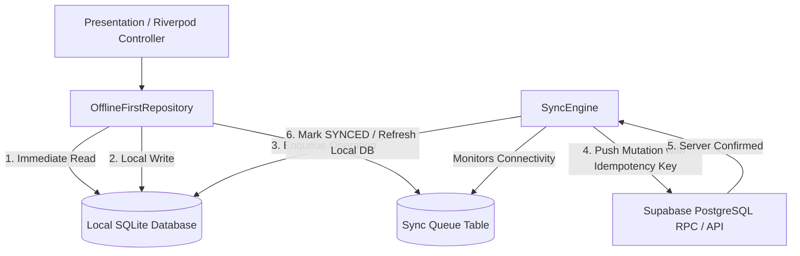

# SafeMate Phase 12.0 — Offline Architecture & Synchronization Audit

## 1. Executive Summary

SafeMate Phase 12 transitions the application from a network-dependent architecture into a resilient, **local-first, server-authoritative** travel companion network. When traveling in low-connectivity areas (trains, remote trails, international flights, underground transit), users must continue to access their itineraries, communicate via queued outbox messages, record safety checkpoints, and receive offline journey guidance without compromising server security, row-level security (RLS), or user privacy.

---

## 2. Current Architecture Baseline Assessment

### 2.1 Existing Persistence Layer
* **Secure Storage**: [`SecureStorageService`](file:///c:/Users/chand/SafeMate/lib/core/security/secure_storage_service.dart) backs session tokens (`safemate_auth_token`, `safemate_refresh_token`, `safemate_user_id`) using Android Keystore `EncryptedSharedPreferences` and iOS Keychain.
* **Disk Database**: No disk-backed relational database (SQLite) currently exists.
* **In-Memory Caches**: Repositories ([`SupabaseTripRepository`](file:///c:/Users/chand/SafeMate/lib/features/trips/data/repositories/supabase_trip_repository.dart), [`SupabaseChatRepository`](file:///c:/Users/chand/SafeMate/lib/features/connections/data/repositories/supabase_chat_repository.dart), [`SupabaseSafeTripRepository`](file:///c:/Users/chand/SafeMate/lib/features/safety/data/repositories/supabase_safetrip_repository.dart), etc.) currently maintain ephemeral in-memory maps (`Map<String, T> _devTrips`, `_devRooms`, `_devSafeTrips`). While effective for mock unit tests, all data is lost upon Android process termination or background recreation.

### 2.2 Offline Simulation vs Real-World Network Failure
* Currently, offline mode is simulated when `_activeClient == null`.
* In production, when connectivity is lost, `_activeClient != null`, but network calls throw socket/timeout exceptions (`PostgrestException`, `ClientException`).
* A true local-first architecture must intercept reads and writes through an offline-aware repository layer backed by a persistent SQLite database and a background sync engine.

---

## 3. Data Classification & Local Storage Policy

Every data entity in SafeMate is classified under an explicit caching rule:

```
                                  DATA CLASSIFICATION
                                          │
       ┌──────────────────────────────────┼──────────────────────────────────┐
       ▼                                  ▼                                  ▼
CATEGORY A: SAFE LOCAL CACHE       CATEGORY B: CONTROLLED CACHE       CATEGORY C: NEVER CACHE
- Own trip details & itineraries   - Confirmed companion summary      - Government IDs (Aadhaar/Pass)
- User profile & preferences       - Chat room metadata & history     - Identity doc photos/blobs
- Packing checklists & notes       - Active SafeTrip status           - Auth secrets & refresh tokens
- UI preferences & draft trips     - Pending outbox messages          - Internal admin/moderation logs
- Deterministic guidance cache     - Local check-in queue             - Continuous raw GPS coordinates
```

### Invalidation & Multi-User Isolation Rule
* **User-Scoped Database Isolation**: All cached records are indexed with a `user_id` foreign key.
* **Account Switch & Logout Purge**: When a user logs out, all Category A and Category B caches tied to that `user_id` are permanently deleted from SQLite. No traveler data may ever bleed across user accounts on shared devices.

---

## 4. Offline-First Repository & Sync Engine Design



### 4.1 Sync States
1. `PENDING`: Operation queued locally, waiting for network or sync cycle.
2. `SYNCING`: Request dispatched with unique `client_operation_id` (UUID v4).
3. `SYNCED`: Server confirmed write; local record updated with server timestamp.
4. `FAILED`: Network or transient server error; scheduled for exponential backoff retry.
5. `CONFLICT`: Server rejected mutation due to version mismatch or state divergence.
6. `CANCELLED`: Superseded by subsequent local or server mutation.

### 4.2 Conflict Resolution Matrix
* **Trip Edits**: Last-write-wins based on validated server timestamp (`updated_at`), with explicit conflict notification if divergent fields exist.
* **SafeTrip State**: **Server is the sole authority**. Stale local devices cannot override server status (e.g. if an alert was triggered on server, local `active` cannot revert it).
* **Chat Messages**: Idempotent through `p_client_message_id`. Re-transmissions never duplicate chat bubbles.
* **Safety & Account Status**: Server rules win unconditionally. If an account is suspended or blocked while offline, server authority halts all synchronization upon reconnection.

---

## 5. Offline Safety & SafeTrip Boundary (Critical Invariant)

1. **No Fake Emergency Claims**: When offline, the app must **never** state or imply that emergency services or trusted contacts have been contacted.
2. **Pending Check-In Transparency**: When a traveler taps "I'm Safe" while offline:
   - The check-in is logged to SQLite with local timestamp and a `PENDING_SYNC` badge.
   - UI status text explicitly reads: `"Check-in recorded locally. Waiting for network to notify companions."`
3. **Emergency Guidance**: Static offline emergency contacts and instructions (e.g., local police, ambulance, embassy numbers) are pre-cached and accessible 100% offline.

---

## 6. Edge AI & On-Device Model Feasibility Assessment

### 6.1 Device Capability Tiers
* **Tier A (High-End, >6 GB RAM, arm64-v8a)**: Technically capable of running lightweight quantized models (e.g. Gemma 2B 4-bit via MediaPipe/TFLite runtime).
* **Tier B (Mid-Range, 4–6 GB RAM)**: Memory pressure risks process termination; LLM execution causes heavy thermal throttling and battery drain.
* **Tier C (Low-End / Emulators / <4 GB RAM)**: Cannot safely execute on-device LLMs without out-of-memory crashes.

### 6.2 SafeMate Edge AI Strategy
* The Copilot architecture will support a `LocalAiGateway` abstraction.
* **Default Offline Engine**: High-fidelity, deterministic rule-based guidance engine providing day-by-day itineraries, packing checklists, and safety advisories offline without requiring massive 1.5 GB model downloads.
* **No Fake AI**: If local AI is not supported on a device tier, the app explicitly displays offline deterministic assistance rather than hallucinating or faking intelligence.
* **Non-Critical Boundary**: Offline AI is strictly restricted to planning, checklist generation, and travel tips. It has **zero authority** over SafeTrip, risk scores, identity, or emergency actions.

---

## 7. Zero-Connectivity Mesh Feasibility & Security Model

### 7.1 Protocol & Physical Transport
* **Transport**: Bluetooth Low Energy (BLE) peripheral advertising and GATT service connections, or Wi-Fi Direct peer-to-peer.
* **Intended Use**: Proximity communication between confirmed companions traveling together in dead zones (e.g. hiking trails, flights).

### 7.2 Threat Model & Defenses
* **Impersonation**: Mesh packets must be cryptographically signed using companion session keys established while online. Proximity alone confers zero trust.
* **Replay Attacks**: Every packet includes a monotonic sequence number, timestamp, and short TTL (e.g. 5 minutes). Duplicate sequence numbers are dropped.
* **Battery Drain**: Continuous BLE scanning depletes battery rapidly. Mesh scanning must be strictly duty-cycled (e.g. 5 seconds scan every 45 seconds) and manually toggleable.
* **Emergency Boundary**: Mesh **never** claims emergency services were dispatched. UI shows: `"Message relayed to nearby companion via direct Bluetooth."`

---

## 8. Package Selection & Dependency Plan

To implement Phase 12 without unnecessary bloat:
1. **`sqflite` (v2.3.3+)**: Standard, robust SQLite plugin for Flutter with complete migration, transaction, and batch support.
2. **`path`**: For SQLite database path resolution.
3. No heavy code-generators or bulky ORMs required; SQLite helpers will maintain clean, testable SQL schemas.

---

## 9. Conclusion & Baseline Status

* **Phase 12.1**: Local SQLite Data Layer implementation — ACCEPTED.
* **Phase 12.2**: Local Data Classification & Policy enforcement — ACCEPTED.
* **Phase 12.3**: Offline-First Repositories & Sync Engine — ACCEPTED.
* **Phase 12.4.1**: Conflict Domain Model & Concurrency Foundation — ACCEPTED.
* **Phase 12.4.2**: Deterministic Conflict Detection Engine — ACCEPTED.
* **Phase 12.4.3**: Entity-Specific Conflict Resolution & Reconciliation — ACCEPTED.

---

## 10. Phase 12.4 Deterministic Conflict Detection & Concurrency Architecture

### 10.1 Version Authority & Optimistic Concurrency Control (OCC)
1. **Server Version Authority**: The server alone holds the authoritative document version (`version INTEGER NOT NULL DEFAULT 1`). SQLite never owns or generates the authoritative server version.
2. **Local Version Tuple**: Local storage distinguishes:
   - `base_server_version`: The specific server version upon which the offline mutation branched.
   - `local_revision`: Local counter of offline uncommitted mutations since branching.
   - `server_version`: The last confirmed server version successfully cached locally.
   - `last_synced_server_version`: The most recent server version successfully synchronized and acknowledged.
3. **Core Version Rule**:
   $$\text{local.baseServerVersion} == \text{server.version}$$
   - When equal: Optimistic concurrency criteria satisfied.
   - When localBase < serverVersion: `ConflictType.staleBase`.
   - When localBase > serverVersion: `ConflictType.concurrentUpdate` (invalid base).
   - **Zero Wall-Clock Dependency**: Wall-clock device time (`updatedAt`) is never used to determine which version wins or to resolve conflicts.

### 10.2 Field-Level Three-Way Comparison Model
For user-editable entities (Trips, Profiles, Itineraries, Preferences), conflict detection employs a three-way snapshot comparison:
- **`BASE`**: Original synchronized state at branch point.
- **`LOCAL`**: Offline edited client state.
- **`SERVER`**: Authoritative current remote state.

#### Field Change Classifications:
- `UNCHANGED`: $B == L \land B == S$
- `LOCAL_ONLY`: $B \ne L \land B == S$ (Safe candidate for non-conflicting merge)
- `SERVER_ONLY`: $B == L \land B \ne S$ (Remote update occurred without local contention)
- `BOTH_SAME`: $B \ne L \land B \ne S \land L == S$ (Independent identical edits)
- `BOTH_DIFFERENT`: $B \ne L \land B \ne S \land L \ne S$ (True field conflict)

### 10.3 Delete Conflict Matrix
- **CASE A (Local Update + Server Deleted)**: Classified as `ConflictType.updateVsDelete`. Deleted records are never silently resurrected.
- **CASE B (Local Delete + Server Modified)**: Classified as `ConflictType.deleteVsUpdate` when $V_{\text{server}} > V_{\text{base}}$.
- **CASE C (Mutual Delete)**: When both local and server agree the entity is deleted, state is reconciled without conflict.

### 10.4 Server-Authoritative Field Freezing
The following fields are strictly server-authoritative and can never become "Keep Mine" candidates:
- `trust_score`, `is_verified`, `verification_status`
- `reliability_rating`, `trips_completed`
- `moderation_state`, `is_suspended`, `suspension_reason`
- `user_id`, `owner_id`, `role`
- SafeTrip status machine (`status`, `is_sos_active`, `safety_authorization`)

Any client mutation attempting to modify these fields is rejected deterministically as `ConflictType.permissionChanged` or `ConflictType.serverStateChanged`.

### 10.5 Domain Boundary Exclusions
1. **Chat Exclusion**:
   - Chat messages are append-only idempotent entities identified by `client_message_id`.
   - They bypass document-level three-way conflict logic.
   - Duplicate HTTP/Realtime deliveries converge onto the single message via `client_message_id` unique constraint.
2. **SafeTrip Exclusion**:
   - SafeTrip lifecycle transitions (`ACTIVE`, `PAUSED`, `ARRIVED`, `COMPLETED`, `CANCELLED`, `EXPIRED`) remain strictly server-authoritative.
   - Offline check-ins remain queued in SQLite with `PENDING_SYNC`.
   - Local state cannot override server safety transitions.

---

## 11. Phase 12.4.3 Entity-Specific Conflict Resolution & Reconciliation Engine

### 11.1 Reconciler Core Architecture (`DeterministicReconciler`)
Phase 12.4.3 answers: **"HOW SHOULD THIS SPECIFIC CONFLICT BE RECONCILED?"**
- **Strictly Deterministic**: Given identical `BASE`, `LOCAL`, and `SERVER` snapshots, the outcome is 100% reproducible.
- **Zero Wall-Clock LWW**: No global Last-Write-Wins based on client/device clocks.
- **Zero AI/LLM Reliance**: No generative models or non-deterministic heuristics are permitted in synchronization reconciliation.
- **Registry Delegation**: The reconciler dispatches each reconciliation context to the registered policy matching `entityType`.

### 11.2 Entity Policy Matrix

| Entity | Conflict Resolution Strategy | Server-Authoritative Frozen Fields | Conflict Fallback |
| :--- | :--- | :--- | :--- |
| **Trip** | 3-way field merge for disjoint user fields (`budget`, `description`, `dates`, `tags`). Lifecycle state transitions enforced. | `user_id`, `owner_id`, `role` | Flag conflict requiring user decision |
| **Profile** | 3-way field merge for profile fields (`bio`, `personality`, `contact`, `languages`). | `trust_score`, `is_verified`, `verification_status`, `moderation_state`, `is_suspended` | Flag conflict; Keep Mine forbidden on security fields |
| **TripPreferences** | 3-state set merge (`notSpecified`, `selected`, `notSelected`). Unspecified -> Selected cleanly merges. | None | Flag conflict if local and server explicitly contradict |
| **Itinerary** | Day-level and item-level disjoint merge. Unique items preserved; day maps merged cleanly. | None | Flag conflict on concurrent edit of identical item ID |
| **ChatMessage** | Append-only idempotency via `client_message_id`. | All message contents (immutable once sent) | Reconciled via deduplication |
| **SafeTrip** | Unconditional server authority. SafeTrip status cannot be altered offline. | `status`, `is_sos_active`, `safety_authorization` | Server authority wins; check-ins preserve intent |
| **Checkin** | Monotonic append queue with `PENDING_SYNC` status. | Server receipt acknowledgement | Enqueue locally, sync monotonically |

### 11.3 Lifecycle Safety Rules
- **Terminal State Protection**: If a trip has been marked `CANCELLED` or `COMPLETED` on the server, local offline edits cannot reactivate it or alter its fields. The update is discarded.
- **Resurrection Prevention**: In `updateVsDelete` scenarios where the server has deleted an entity, local updates are discarded without resurrection.
- **Mutual Delete Convergence**: If both client and server deleted an entity, the outcome is marked `reconciled` with `isDeleted = true`.

### 11.4 Conflict Resolution Presentation & UX Rules
- **Non-Conflicting Merges**: Automatically reconciled without interrupting the traveler.
- **Conflicting User Edits**: Present clean interactive comparison showing Local vs Server values.
- **Forbidden Actions**: "Keep Mine" is strictly hidden and disabled when the conflict involves server-authoritative fields (`trust_score`, `verification_status`, `moderation_state`, `status` of SafeTrip).

---

## 12. Phase 12.4.4 Conflict Resolution User Interface & Interactive Workflows

### 12.1 Traveler-Centric Presentation Architecture
Phase 12.4.4 completes the end-to-end synchronization collision pipeline by translating technical version conflicts into clear, non-technical traveler UX components:
1. **`ConflictBanner`**:
   - Non-intrusive alert card rendered on `TripsHomeScreen` whenever active conflicts exist in the sync queue.
   - Summarizes conflict count without developer jargon.
   - Provides a "Review" call-to-action navigating to the conflict resolution flow.
2. **`ConflictReviewScreen`**:
   - Presents a card per conflicting item with entity badges (`TRIP`, `PROFILE`, etc.).
   - Visual field-level diff table displaying `Field Name`, `Offline Change`, and `Latest Server Value`.
   - Distinct informational badges (`Server Authority`) highlighting immutable security/trust/status fields.
   - Dynamic action buttons bounded by server permissions:
     - **Use Latest Version** (`UserResolutionAction.acceptServer`): Always available.
     - **Keep My Changes** (`UserResolutionAction.keepLocal`): Rendered only when no server-authoritative fields are involved. Re-queues the mutation with updated base version.
3. **State Management Integration**:
   - `pendingConflictsProvider`: Riverpod future provider querying `LocalDatabaseService.getConflictSyncRecords`.
   - Automatically invalidates and refreshes upon resolution completion.

---

## 13. Phase 12.4.5 Conflict Action Hardening & Reconciliation Finalization

### 13.1 Hardened Conflict Actions
Phase 12.4.5 makes every traveler conflict action transactionally correct, server-version-aware, idempotent, secure, and resistant to stale retry/reconciliation loops:

1. **Accept Server (`UserResolutionAction.acceptServer`)**:
   - Fetches and applies the authoritative server snapshot directly to the local SQLite entity cache (`local_trips`, `local_profiles`, `local_itineraries`).
   - Updates `server_version`, `base_server_version`, and `last_synced_server_version` to the server's version.
   - Resets `local_revision` to 0.
   - Clears the obsolete conflicted mutation from `sync_queue`.
   - Strictly idempotent: repeated invocations do not duplicate or corrupt state.
   - Prevents stale mutation retry in the background `SyncEngine`.

2. **Keep My Changes (`UserResolutionAction.keepLocal`)**:
   - **Never retries against old base version**: Instead of retrying an operation with base version 9 against server version 10 (which produces immediate 409 collisions), Keep My Changes obtains the latest server version ($V_{server}=10$).
   - **Re-runs 3-Way Reconciliation**: Evaluates permitted local modifications against the server baseline using `DeterministicReconciler`.
   - **Freezes Server-Authoritative Fields**: Enforces strict security boundary; fields such as `trust_score`, `verification_status`, `moderation_state`, and `status` remain pinned to the server values.
   - **Creates a NEW Mutation with NEW Operation ID**: Generates a fresh `client_operation_id` (UUIDv4) with `baseServerVersion = 10` and `local_revision = 1`.
   - **Preserves Audit Linkage**: Links the new operation to the prior conflict identifier.
   - **Clears Old Mutation**: Safely removes the obsolete conflicted mutation from the queue.

3. **Stale UI Protection (`StaleConflictVersionException`)**:
   - The resolution controller validates the server version before applying any decision.
   - If the server advanced from version 10 to 11 while the traveler reviewed the screen, the controller rejects the stale submission and triggers a screen reload with the latest server state.

4. **Delete Safety**:
   - If an entity was deleted on the server, "Keep My Changes" is strictly blocked.
   - The UI presents a "Server Deleted / No Longer Available" badge and offers only "Dismiss" (which safely removes the local copy without resurrecting the deleted item).

5. **Realtime Reconciliation Safety (`RealtimeReconciler`)**:
   Incoming server events are evaluated by strict version comparison:
   - **Older version ($V_{event} < V_{local}$)**: `IGNORE` (stale event dropped).
   - **Same version ($V_{event} == V_{local}$)**: `DEDUPLICATE` (idempotent no-op).
   - **Newer version ($V_{event} > V_{local}$)**: `RECONCILE` (auto-fast-forward if clean, or conflict review if overlapping edits exist).
   - **Deleted records**: Purged locally and immune to resurrection from delayed older update events.


