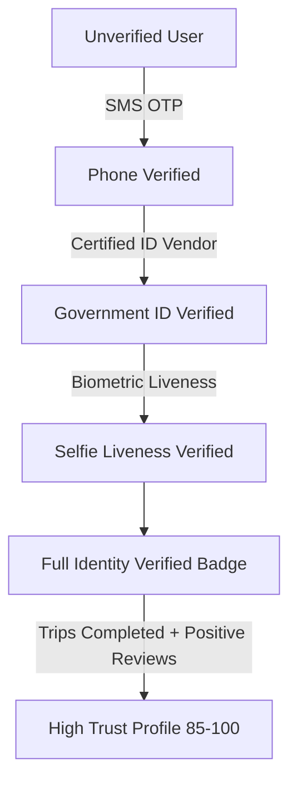

# SafeMate Trust Verification & Safety Architecture

## 1. Executive Summary
SafeMate is **not a dating application**. It is an AI-powered real-time trusted travel companion network built upon radical accountability, privacy-first design, and mutual traveler respect.

Never at any point does SafeMate display "100% Safe", "Guaranteed Safe", or "Risk-Free Traveler". Verification confirms the authenticity of an identity process; it does not predict or guarantee human behavior.

---

## 2. Multi-Layer Trust Verification Hierarchy

### Layer 1: Phone Number Verification (15 pts)
- Two-way cryptographic SMS OTP verification.
- Enforces 1:1 phone-to-account mapping to mitigate bulk fake accounts.

### Layer 2: Government ID Verification (30 pts)
- Third-party identity verification provider integration.
- Validates government-issued passport, driver's license, or national identity card.
- **Zero Document Retention Rule**: SafeMate **NEVER** stores raw government documents, scanned images, or national ID numbers (e.g. Aadhaar, SSN). Only the verification status, provider ID, verification type, and cryptographically signed confirmation hashes are retained in `public.verification_records`.

### Layer 3: Biometric Selfie Liveness
- Interactive active liveness detection prevents static photo spoofing and synthetic identity fraud.

---

## 3. Explainable Trust Score Formula ($v1$)

The SafeMate Trust Score is fully explainable and deterministic. Travelers can inspect the exact mathematical breakdown of their score at any time:

$$\text{Trust Score} = \min(100, P + V_{\text{phone}} + V_{\text{id}} + T + R) - D$$

| Component | Weight / Max Points | Description |
| :--- | :--- | :--- |
| **Profile Completeness ($P$)** | **20 pts** | Bio, travel preferences, languages, verified photo, home city |
| **Phone Verification ($V_{\text{phone}}$)** | **15 pts** | Verified phone record match |
| **Government ID & Liveness ($V_{\text{id}}$)** | **30 pts** | Certified ID & biometric liveness match |
| **Completed Journeys ($T$)** | **15 pts** | 3 points per completed journey (max 5 journeys = 15 pts) |
| **Companion Reviews ($R$)** | **20 pts** | Multi-dimensional companion review rating (10 pts baseline, up to 20 pts based on 5-star avg) |
| **Safety Penalties ($D$)** | **Variable** | Deductions for confirmed no-shows, violations, or substantiated reports |

---

## 4. Cryptographic Meetup Verification Codes

To prevent airport or transit station impersonation when meeting in person:
1. SafeMate generates a 6-digit cryptographically secure verification code via `Random.secure()`.
2. The code has a 24-hour TTL (`expires_at`).
3. Travelers exchange and compare their 6-digit codes upon meeting in a public station concourse before departing together.
4. Validation uses constant-time XOR comparison to prevent timing side-channel attacks.
