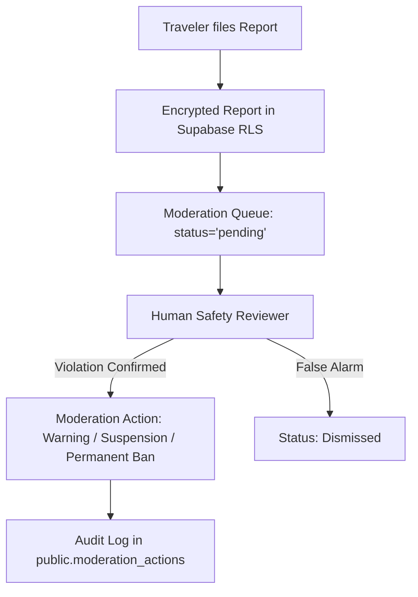

# SafeMate Safety & Moderation Architecture

## 1. Client-Side AI Safety Rule Engine
SafeMate runs a deterministic, privacy-preserving safety rule engine locally on device to detect high-risk patterns in communication:

1. **Credential Phishing Protection (CRITICAL)**:
   - Identifies keywords: `otp`, `verification code`, `password`, `login pin`, `security question`.
   - Blocks social engineering attempts asking travelers to disclose SMS codes.
2. **Financial Scam & Wire Advisory (WARNING)**:
   - Identifies phrases: `send money`, `wire money`, `crypto`, `advance payment`, `gpay me`, `booking deposit`, `upi id`.
   - Admonishes travelers that each companion must buy their own transport tickets directly.
3. **Off-Platform Pressure Advisory (INFO)**:
   - Flags attempts to rush off-platform prior to establishing verified credentials.
   - Suggests safe canned replies with one-tap population.

---

## 2. Moderation Workflow & Incident Escalation

- **Human-in-the-loop**: Automated algorithms flag and warn; permanent account bans and suspensions are adjudicated by human safety moderators with transparent appeals.
- **Account Suspension Enforcement**: Authenticated route guards immediately redirect suspended accounts to `/auth/suspended` and revoke active sessions.

---

## 3. SafeTrip Idempotency & Security Boundaries
- **Idempotency**: All safety transitions (activation, check-ins, arrival, completion) require unique client-generated idempotency keys (`idempotency_key`), preventing duplicate operations or network replay attacks upon reconnecting.
- **No Autonomous Emergency Dispatch**: SafeMate never simulates emergency calls, 911/112 auto-dialing, or fake dispatch. All emergency actions enforce a clear dialer confirmation boundary.
- **Calm Escalation Policy**: Missed check-in notifications are non-alarming and never declare a user "in danger".
- **Anti-Enumeration RLS**: PostgreSQL Row-Level Security ensures that unauthorized users and strangers querying SafeTrip IDs receive zero records or permission denied.
